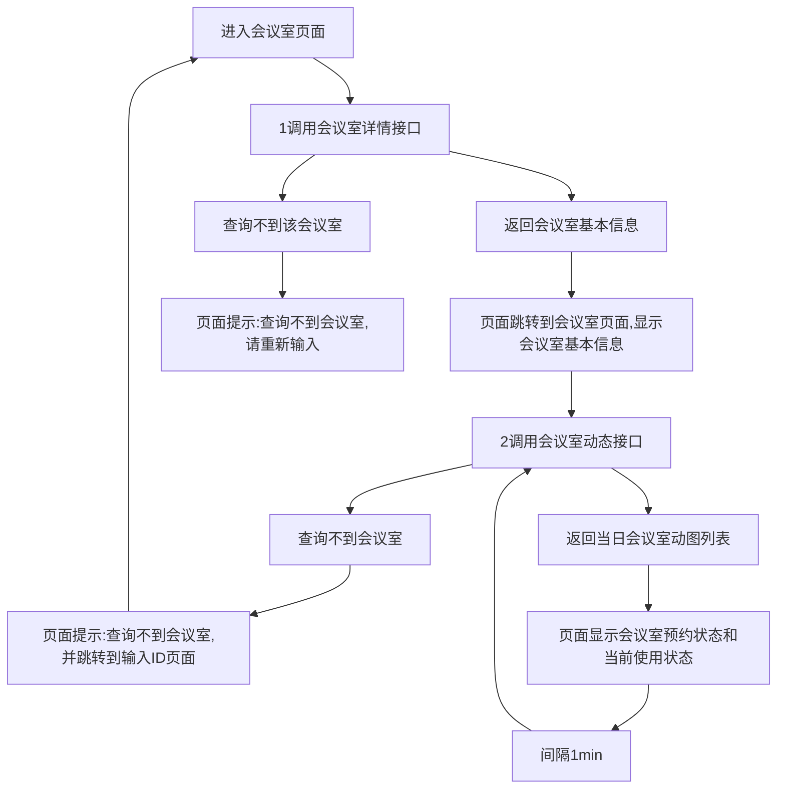

## 需求描述
#### 需求背景
  - 围绕企业办公会议室环境，在每个会议室墙壁上用iPad（9.7寸）横向展示会议室的预约详情和使用状态。
#### 主要场景
  - 办公室员工可以查看到会议室的当天的使用情况：时间段、预约人、会议主题，当前会议状态
  - 提供会议室预约二维码，方便员工快速预约合适的会议室。

#### Mockup
  - 会议室ID
  

  - 会议室预定状态-空闲
  

  - 会议室预定状态-使用中
  

#### 功能描述
  - 输入会议室ID
    - 用户在iPad safri 中输入网址，进入到会议室预定系统页面
    - 输入会议室ID，点击确定，进入会议室页面
 - 会议室页面
   - 会议基本信息（左侧）
     - 会议名称
     - 设备信息
       - 若出现没有对应图标的设备，则只显示设备名称即可，不需要配相应的 icon
     - 大小信息
      - 若没有获取到大小信息，则不显示
      - 考虑到会议室基本信息一般不会变的，调用一次接口后可以本地存储这些数据

   - 预约二维码——跟会议室ID绑定（左侧页面）
     - 样式采用一般二维码样式即可

   - 使用状态
     - 根据接口获取的预约信息，本地判断当前使用状态（左侧页面）
      - 若 09:00-10:00 有人预定了会议室，则 09:00-10:00 会议室状态为使用中
      - **获取不到预约信息时，默认显示为:空闲**

   - 当前使用信息（左侧页面）
       - 会议主题
       - 参会人员
       - 主持人
       - **若会议室处于空闲，则会议主题、参会人员、主持人默认值为空白**

   - 当日预约状态(右侧页面)
        - 时间段 、预约人、会议主题
        - **没有预约的时间段，则不显示预约人、会议主题**
        - **若当日预约信息很多，单个页面展示不全，可采用滚动显示**
        - 当日会议预约情况需要1min获取一次
        - **若当日没有预约信息，则页面显示：一切进展顺利**
  - 需要调用的接口
    - 会议室详情接口
    - 会议室动图接口

#### 页面逻辑
##### 输入会议室ID页面要求
  - 输入框 placeholder 的文字为：会议室 ID，输入框有值时，文本消失，无值时，文本出现
  - 输入框有值时，输入框右侧出现快速删除 button
  - 光标切换到输入框时，键盘弹起，默认展示字母和数字键盘，点击完成，键盘收起

##### 会议室页面要求
  - 错误提示用 message 控件，2s后消失

##### 流程图

